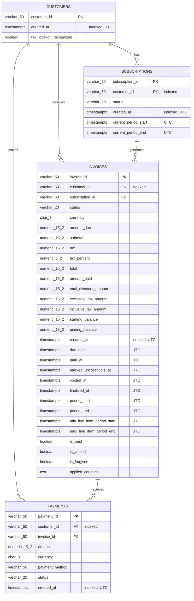

```mermaid
erDiagram
    CUSTOMERS ||--o{ SUBSCRIPTIONS : has
    CUSTOMERS ||--o{ INVOICES : receives
    CUSTOMERS ||--o{ PAYMENTS : makes
    SUBSCRIPTIONS ||--o{ INVOICES : generates
    INVOICES ||--o{ PAYMENTS : receives

    CUSTOMERS {
        varchar_50 customer_id PK
        timestamptz created_at "indexed, UTC"
        boolean tax_location_recognized
    }

    SUBSCRIPTIONS {
        varchar_50 subscription_id PK
        varchar_50 customer_id FK "indexed"
        varchar_20 status
        timestamptz created_at "indexed, UTC"
        timestamptz current_period_start "UTC"
        timestamptz current_period_end "UTC"
    }

    INVOICES {
        varchar_50 invoice_id PK
        varchar_50 customer_id FK "indexed"
        varchar_50 subscription_id FK
        varchar_20 status
        char_3 currency
        numeric_15_2 amount_due
        numeric_15_2 subtotal
        numeric_15_2 tax
        numeric_5_2 tax_percent
        numeric_15_2 total
        numeric_15_2 amount_paid
        numeric_15_2 total_discount_amount
        numeric_15_2 exclusive_tax_amount
        numeric_15_2 inclusive_tax_amount
        numeric_15_2 starting_balance
        numeric_15_2 ending_balance
        timestamptz created_at "indexed, UTC"
        timestamptz due_date "UTC"
        timestamptz paid_at "UTC"
        timestamptz marked_uncollectible_at "UTC"
        timestamptz voided_at "UTC"
        timestamptz finalized_at "UTC"
        timestamptz period_start "UTC"
        timestamptz period_end "UTC"
        timestamptz min_line_item_period_start "UTC"
        timestamptz max_line_item_period_end "UTC"
        boolean is_paid
        boolean is_closed
        boolean is_forgiven
        text applied_coupons
    }

    PAYMENTS {
        varchar_50 payment_id PK
        varchar_50 customer_id FK "indexed"
        varchar_50 invoice_id FK
        numeric_15_2 amount
        char_3 currency
        varchar_50 payment_method
        varchar_20 status
        timestamptz created_at "indexed, UTC"
    }
```